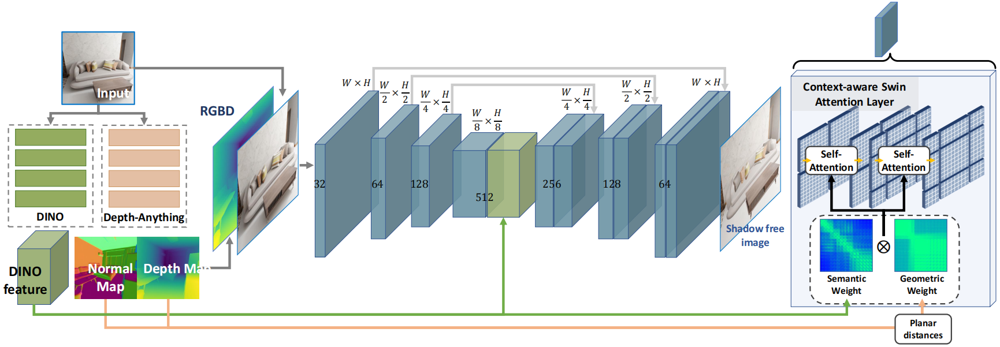
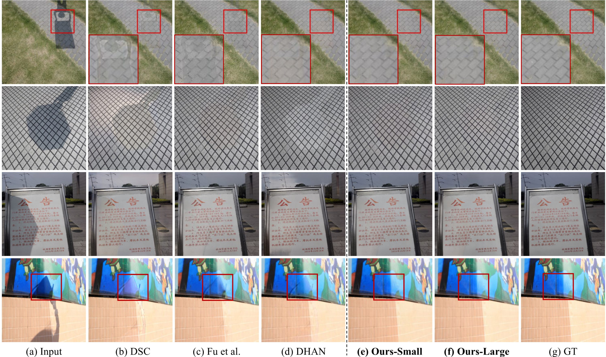

# OmniSR 
This is the official implementation of the paper [OmniSR: Shadow Removal under Direct and Indirect Lighting](https://arxiv.org/abs/2410.01719).

<!-- [](https://paperswithcode.com/sota/shadow-removal-on-istd?p=shadowformer-global-context-helps-image)
[](https://paperswithcode.com/sota/shadow-removal-on-adjusted-istd?p=shadowformer-global-context-helps-image)
[](https://paperswithcode.com/sota/shadow-removal-on-srd?p=shadowformer-global-context-helps-image) -->

<!-- #### News
* **Feb 24, 2024**: Release the pretrained models for ISTD and ISTD+.
* **Feb 18, 2024**: Release the training and testing codes.
* **Feb 17, 2024**: Add the testing results and the description of our work. -->

## Introduction
To address the challenge of shadow removal in complex indoor scenes, we propose a novel shadow removal network that considers both direct and indirect shadows, often neglected in existing datasets. Our approach leverages a high-quality synthetic dataset that includes both types of shadows, generated via path tracing. By utilizing RGB-D input and integrating semantic and geometric information, our method accurately restores shadow-free images. The network compares intensities within semantically similar regions and reweights features using local attention based on geometric and semantic similarities, without relying on shadow masks.

For more details, please refer to our [original paper](https://arxiv.org/abs/2410.01719).


<p align=center></p>


## Requirement
* Python 3.9
* Pytorch 2.0.1
* CUDA 11.7
```bash
pip install -r requirements.txt
```

## Datasets
* ISTD [[link]](https://github.com/DeepInsight-PCALab/ST-CGAN)  
* ISTD+ [[link]](https://github.com/cvlab-stonybrook/SID)
* SRD [[Training]](https://drive.google.com/file/d/1W8vBRJYDG9imMgr9I2XaA13tlFIEHOjS/view)[[Testing]](https://drive.google.com/file/d/1GTi4BmQ0SJ7diDMmf-b7x2VismmXtfTo/view)
* WSRD+ [[link]](https://github.com/movingforward100/Shadow_R)
* INS [[link]](https://1drv.ms/f/c/293105fdd25c43e1/Ehs2NWKPVmFPrnuudfVUM8EBC3DzwOuKTcm_kmmM4h17dg?e=Dqpb7u)

## Pretrained models
[ISTD](https://1drv.ms/u/c/293105fdd25c43e1/EXNcyRJASQ5Ir3po_a-Py0cBPCTPXh-j9x8xP7cIffNENA?e=z4YScV) | [ISTD+](https://1drv.ms/u/c/293105fdd25c43e1/EcW41sXmrZFFjqyTwE84uR0BdrkzGp3hb3vqhmvpnVxWqQ?e=k8ZnI4) | [SRD](https://1drv.ms/u/c/293105fdd25c43e1/EaI4VEPzxC9FjbV1nzn4TOwBOQDuHWW6imXcvJFkPVw2Sg?e=0S0aLy) |   [WSRD+](https://1drv.ms/u/c/293105fdd25c43e1/ESOPejl-4l5HvdxGsopu5oIB8SUGu1o6XquU2SRKEI6Cuw?e=leX3qD) | [INS](https://1drv.ms/u/c/293105fdd25c43e1/ERjBBybbNvZMpiAPJegUt1QBGgNlfoOcjK6W3xRO05GQgw?e=axC80v) 

Please download the corresponding pretrained model and modify the `weights` in `testDDP.py`.

## Test
You can directly test the performance of the pre-trained model as follows
1. Modify the paths to dataset and pre-trained model. You need to modify the following path in the `test_DDP.py` 
```python
input_dir # shadow image input path -- Line 19
result_dir # result image output paht --Line 21
weights # pretrained model path -- Line 23
```
2. Test the model
```shell
./test.sh
```

You can change the count of GPU by change the argument `--nproc_per_node` in `test.sh`

## Train
1. Download datasets and set the following structure
```
|-- ISTD_Dataset
    |-- train
        |-- origin # shadow image
        |-- shadow_mask # shadow mask
        |-- shadow_free # shadow-free GT
        |-- depth # depth map of the original image
        |-- normal # normal map of the original image
    |-- test
        |-- origin # shadow image
        |-- shdaow_mask # shadow mask
        |-- shadow_free # shadow-free GT
        |-- depth # depth map of the original image
        |-- normal # normal map of the original image

``` 
2. Run [Depth Anything V2](https://github.com/DepthAnything/Depth-Anything-V2) to generate normal and depth map of the original image
3. Then, download this [weight](https://dl.fbaipublicfiles.com/dinov2/dinov2_vitl14/dinov2_vitl14_pretrain.pth) of [dinov2](https://github.com/facebookresearch/dinov2) and clone the code of [dinov2](https://github.com/facebookresearch/dinov2) into this folder
4. You need to modify the following terms in `option.py`
```python
train_dir  # training set path
val_dir   # testing set path
```

If you want to train the network on 256X256 images,change the `train.sh` with the follow code:
```python
CUDA_VISIBLE_DEVICES="0,1,2,3" python -m torch.distributed.launch --nproc_per_node 1 --master_port 29500 ./train_DDP.py --win_size 8 --train_ps 256
```
or you want to train on original resolution, e.g., 480X640 for ISTD:
```python
CUDA_VISIBLE_DEVICES="0,1,2,3" python -m torch.distributed.launch --nproc_per_node 1 --master_port 29500 python train.py --warmup --win_size 10 --train_ps 320
```

## Evaluation
The results reported in the paper are calculated by the `matlab` script used in [previous method](https://github.com/zhuyr97/AAAI2022_Unfolding_Network_Shadow_Removal/tree/master/codes). Details refer to `evaluation/measure_shadow.m`.


## Results
#### Evaluation on INS
The evauluation results on INS are as follows
| Method | PSNR | SSIM |
| :-- | :--: | :--: | 
| DHAN |  27.84 | 0.963 | 
| Fu et al. | 27.91 | 0.957 |
| ShadowFormer | 28.62 | 0.963 | 
| DMTN | 28.83 | 0.969 | 
| ShadowDiffusion | 29.12 | 0.966 | 
| **OmniSR (Ours)** | **30.38** | **0.973** |

#### Visual Results
<p align=center></p>

#### Testing results
The testing results on dataset ISTD, ISTD+, SRD,  WSRD+ and INS are: [results](https://1drv.ms/f/c/293105fdd25c43e1/EmzoLrPSZGFDtuzWXkGEUQcBZvBj8jmBvsLdLHHnigsqXQ?e=V1IC2y)

## References
Our implementation is based on [ShadowFomrer](https://github.com/GuoLanqing/ShadowFormer). We would like to thank them.

<!-- Citation
-----
Preprint available [here](https://arxiv.org/pdf/2302.01650.pdf). 

In case of use, please cite our publication:

L. Guo, S. Huang, D. Liu, H. Cheng and B. Wen, "ShadowFormer: Global Context Helps Image Shadow Removal," AAAI 2023.

Bibtex:
```
@article{guo2023shadowformer,
  title={ShadowFormer: Global Context Helps Image Shadow Removal},
  author={Guo, Lanqing and Huang, Siyu and Liu, Ding and Cheng, Hao and Wen, Bihan},
  journal={arXiv preprint arXiv:2302.01650},
  year={2023}
}
``` -->

## Contact
If you have any questions, please contact 905233173@qq.com
